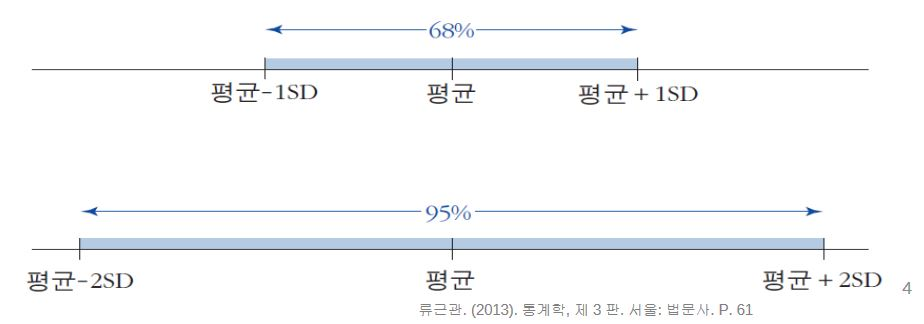

# RMS(root-mean-square)
* rms : 숫자들의 제곱의 평균   
    > 0, 1, -3, 3, -1의 rms는? 
    * &radic;0²+1²+3²+3²+1²/5 = 2
    * &radic;0+1+3+3+1/5=1.6
* 부호를 제거한 숫자들의 평균보다 RMS가 크다
# 표준편차

* 숫자들의 약 68% 정도가 평균으로부터 1표준편차 이내로 떨어져 있음
* 숫자들의 약 95% 정도가 평균으로부터 2표준편차 이내로 떨어져 있음
# 문제
1. 분포가 대칭적인 형태를 가질 때, 해당 분포의 대푯값으로 평균이 가장 적합하다고 볼 수 있다.
    > 거짓 : 분포가 대칭형이더라도 두 봉우리가 올라온 대칭 그래프에서는 평균이 대표값이 될 수 없다. 
